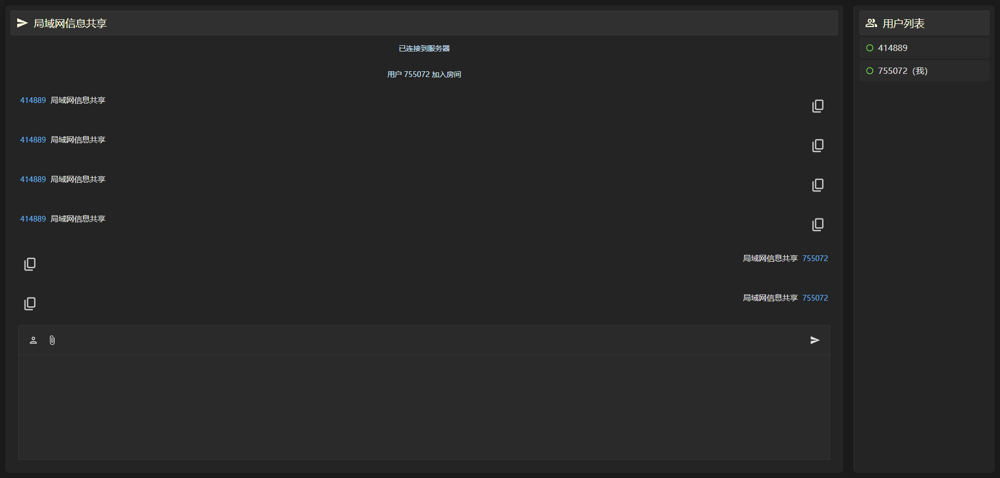
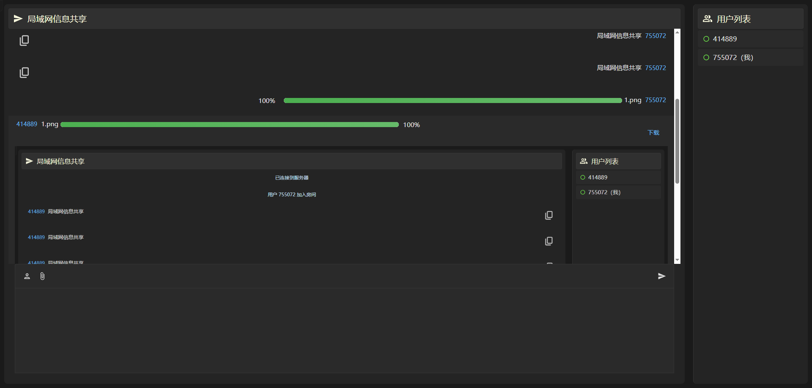

# 📡 局域网信息共享系统（WebRTC + Flask + Socket.IO）

学习中 自用局域网信息共享

## 📝 项目简介

本项目是一个基于 **WebRTC、Flask 和 Socket.IO** 的局域网信息共享系统，支持：

- **实时通信**（基于 WebRTC）
- **消息传输**（文本、文件）
<!-- - **用户房间管理** -->

适用于 **同一局域网** 下的快速信息共享。

---

## 🚀 功能特点

✅ **WebRTC 信令服务器**：支持 `offer`、`answer` 和 `ICE candidates` 交换  

✅ **房间管理**：支持多个用户加入同一房间，查看在线成员

✅ **实时消息**：支持文本消息、用户名修改

✅ **文件传输**：支持分片文件传输，适用于大文件  


---


---

## 🛠 技术栈

- **Flask** - 轻量级 Web 服务器框架
- **Flask-SocketIO** - 处理 WebSocket 连接，实现实时通信
- **WebRTC** - 支持 P2P 连接，实现视频通话和文件传输
- **HTML + JavaScript** - 前端页面交互

---

## 📦 环境依赖

确保已安装以下环境：

- **Python 3.x**
- **Flask**
- **Flask-SocketIO**
- **WebRTC（浏览器支持）**

使用以下命令安装依赖：

```bash
pip install flask flask-socketio eventlet
```

---

## 🔧 安装与运行

1. **克隆项目**

   ```bash
   git clone https://github.com/beginninglatemonth/intranet-chat.git
   cd intranet-chat
   ```

2. **启动服务**

   ```bash
   python server.py
   ```

   服务会在 **`5000`** 端口启动，如果被占用，会自动尝试下一个端口。

3. **访问前端**
   在浏览器中打开：

   ```bash
   http://<本机IP>:5000
   ```

   - **Windows** 可用 `ipconfig` 获取本机 IP
   - **Mac/Linux** 可用 `ifconfig` 或 `hostname -I`

---

## 📌 使用说明

<!-- 1. 访问网页后，输入用户名并加入房间   -->
1. 访问网页后，自动加入房间(手动指定房间暂未做)
2. 可以发送文本信息，与房间成员聊天  
3. 选择文件进行传输，其他用户可接收文件  

---

## 📜 文件结构

``` md
/intranet-chat
│── src/
│   └── server.py          # Flask + Socket.IO 服务器
│── templates/
│   └── index.html         # 前端页面
│── static/
│   ├── js/
│   │   └── index.js        # 前端相关逻辑
│   │   └── socket.io.js        # WebRTC相关逻辑
│   └── css/
│       └── index.css      # 前端样式
└── README.md              # 项目说明
```

---

## 🛠️ 可能遇到的问题

❗ **无法访问服务器**

- 确保防火墙未阻止 Flask 端口（默认 5000）
- 服务器端口可能已被占用，尝试 `5001`、`5002`...
- 使用 `http://localhost:5000` 进行测试

❗ **WebRTC 连接失败**

- 确保双方在 **同一局域网**
- 检查浏览器是否支持 WebRTC（Chrome/Firefox）

<!-- ---

## 📃 许可证

 -->
